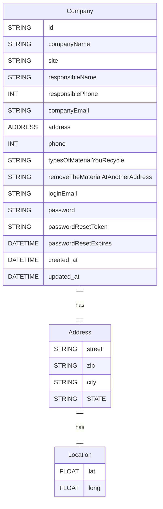

# backend-recollect

Repositório com a parte backend do projeto recollect.

Diagrama ER

```mermaid
erDiagram
    Company ||--|| Address: has
    Company{
        STRING id
        STRING companyName
        STRING site
        STRING responsibleName
        INT responsiblePhone
        STRING companyEmail
        ADDRESS address
        INT phone
        STRING typesOfMaterialYouRecycle
        STRING removeTheMaterialAtAnotherAddress
        STRING loginEmail
        STRING password
        STRING passwordResetToken
        DATETIME passwordResetExpires
        DATETIME created_at
        DATETIME updated_at
    }
    Address {
        STRING street
        STRING zip
        STRING city
        STRING STATE
    }
    Address ||--|| Location: has
    Location{
        FLOAT lat
        FLOAT long
    }
```
